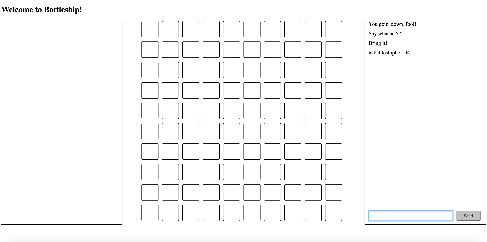

# battleship
A battleship game for the webz.

## Current Progress

## TODO
* Integrate with Twitter
	* ~~setup battleship twitter client~~
	* user authentication via twitter
	* associate game data with accounts
	* parse incoming tweets and update state accordingly
* Define app data structure
* Map game state to UI
* Setup DB to store game data
* Refactor CSS
* Add to home screen
* Offline support
